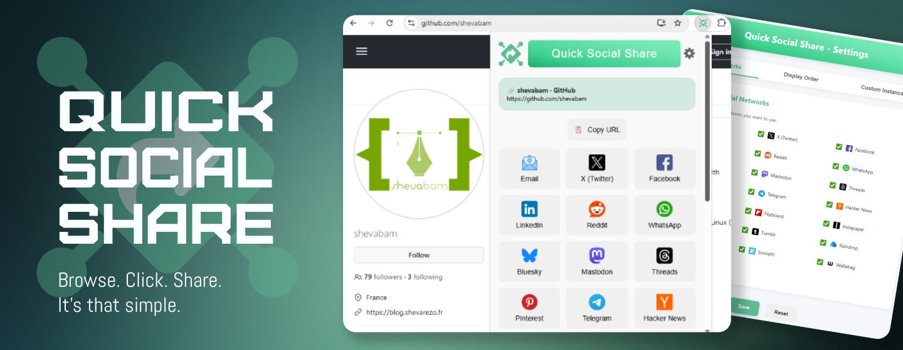
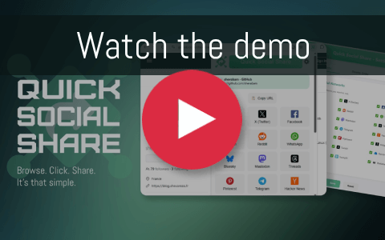
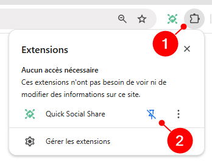
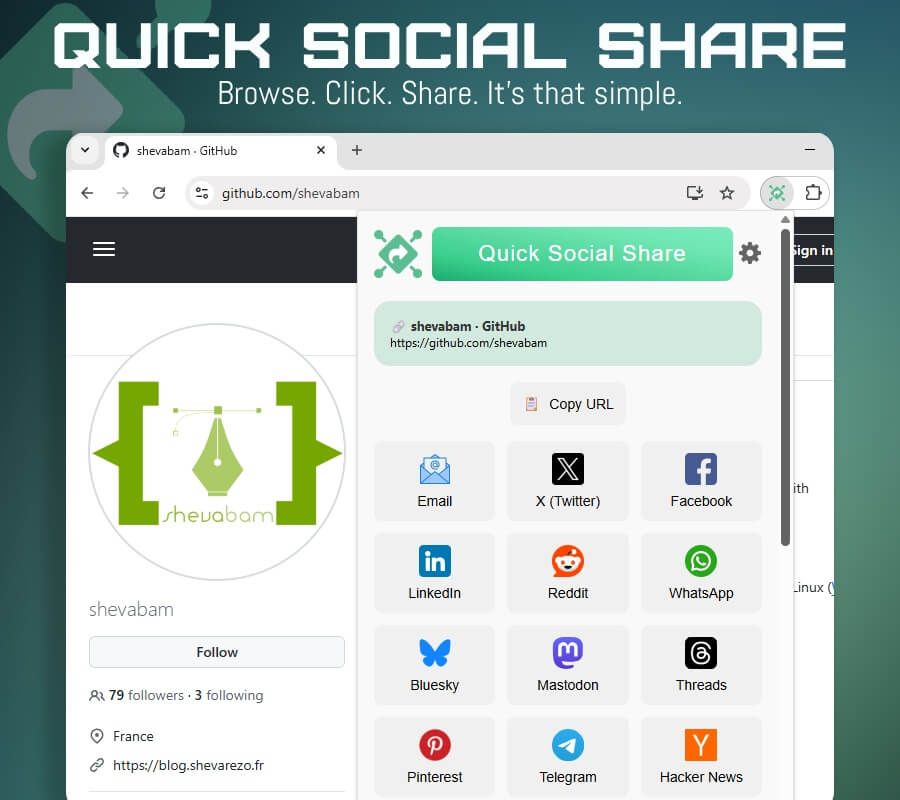
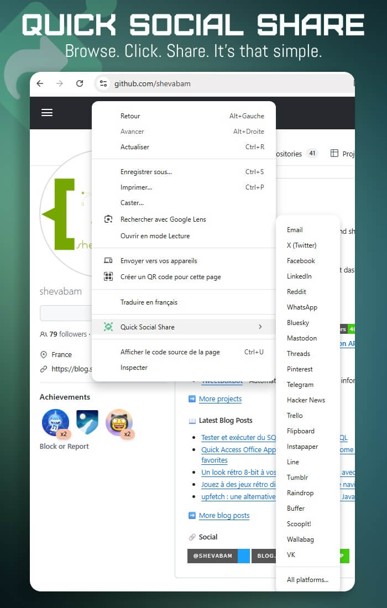
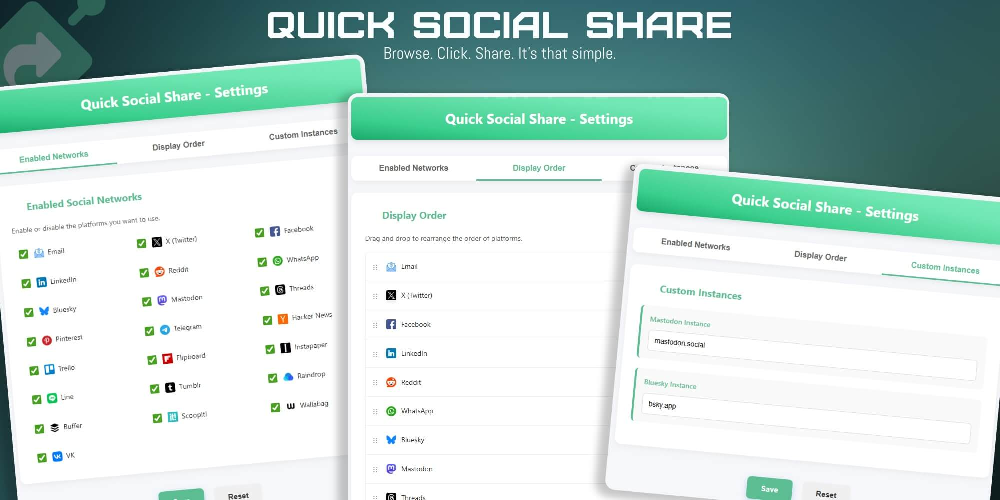

# Browser extension "Quick Social Share"

A browser (Chrome, Edge) extension that allows you to quickly share web pages across multiple social networks and platforms.

## Features

- 🚀 **Share current page URL and title to 20+ platforms**, including:
    - Social networks (Twitter/X, Facebook, LinkedIn, Reddit, Threads, VK)
    - Messaging apps (WhatsApp, Telegram, Line)
    - Bookmarking services (Instapaper, Raindrop, Wallabag)
    - Decentralized platforms (Mastodon, Bluesky)
- 🖱️ **Context menu integration** for quick sharing
- ⚙️ **Customizable platform list**
- 🔀 **Drag-and-drop reordering** of platforms
- 🏷️ **Custom instance support** for Mastodon and Bluesky
- 📋 **Copy URL with one click**
- ✨ **Clean and modern interface**

## Installation

Download the extension from the [**Chrome Web Store**](https://chromewebstore.google.com/detail/quick-social-share/lnimmkjipefahhllbodggpcngbnjafge) or [**Microsoft Edge Store**](
https://microsoftedge.microsoft.com/addons/detail/occjimhfamincjfpmdcpfiiijeopjpkj)

After installing the extension, pin it to your browser:

## Usage

### Popup Interface

Click the extension icon in your toolbar to open the sharing popup. From there you can:
- See the current page title and URL
- Copy the URL to clipboard
- Share to any enabled platform with one click
- Access settings via the gear icon

You can also open this popup using the keyboard shortcut: `Alt+Shift+S`.

### Context Menu

Right-click anywhere on a page to access the Quick Social Share context menu:
- Share directly to specific platforms
- Open the full sharing popup via "All platforms..."

### Customization

Access the settings page by:
1. Clicking the gear icon in the popup, or
2. Right-clicking the extension icon and selecting "Options"

In the settings you can:
- Enable/disable specific platforms
- Reorder platforms via drag-and-drop
- Set custom instances for Mastodon and Bluesky
- Reset all settings to defaults

## Supported Platforms

- Social Networks
  - X (Twitter)
  - Facebook
  - LinkedIn
  - Reddit
  - Instagram
  - Pinterest
  - Tumblr
  - Threads
  - VK
  
- Messaging
  - WhatsApp
  - Telegram
  - Line
  - Email
  
- Decentralized
  - Mastodon
  - Bluesky
  
- Bookmarking
  - Instapaper
  - Raindrop
  - Wallabag
  
- Others
  - Hacker News
  - Flipboard
  - Trello
  - Buffer
  - Scoop.it

## Privacy

This extension:
- Does not collect any personal data
- Does not track your browsing
- Only accesses the current tab's URL and title when sharing
- Stores settings locally in your browser

## Contributing

Contributions are welcome! Feel free to:
- Report bugs
- Suggest features
- Submit pull requests

If you find this extension useful, you can also support its development by [buying me a pizza](https://buymeacoffee.com/shevabam).

## Author

Created by [@shevabam](https://github.com/shevabam)

- [X](https://x.com/shevabam)
- [Bluesky](https://bsky.app/profile/shevabam.bsky.social)
- [Mastodon](https://mastodon.social/web/@shevabam)
- [Blog](https://blog.shevarezo.fr)
